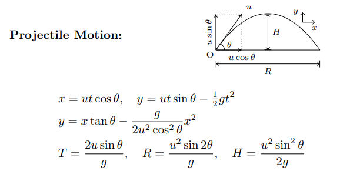

# Projectile-Motion-Library
### Provides basic projectile motion methods for an ideal body on (0,0) on x-y plane with some angle, velocity, gravity and time frame slice for plotting requirements
## Projectile Motion Summary:

## Features:
- Tells max height achieved by projectile
- Tells max horizontal distance (range) achieved after throw
- Tells total time of flight
- Tells horizontal component of velocity after throw
- Tells vertical component of velocity after throw against the given time frame
- Gravity is initialized as g= 9.8m/s^2, but can changed if given otherwise
- Plots the graph of path traversed by the projectile body (each point on graph is 1/10th of a second, but can be toggled)

### Assumptions:
#### As every hypothetical projectile motion:
- no air resistance
- surface remain flat till infinity
- gravity does not change with height
- time is in seconds
- velocity and distance are in m/s & m respectively
- object thrown starts at origin

----
## Future Plans:
- adding a simulate method, which will show and save an gif animation of the projectile trijectory
- adding air drag and multiple bounce calculations for spherical bodies and applying Bernaulli's Principle
- projectile motion at an incline calculations
- split a body in 2 parts mid-flight
- projectile motion setup with more advanced initialization such as: height of throw, height of landing, vertical throw, wind-affect, etc
- method(s) to create dataset(s) for the feature(s) mentioned